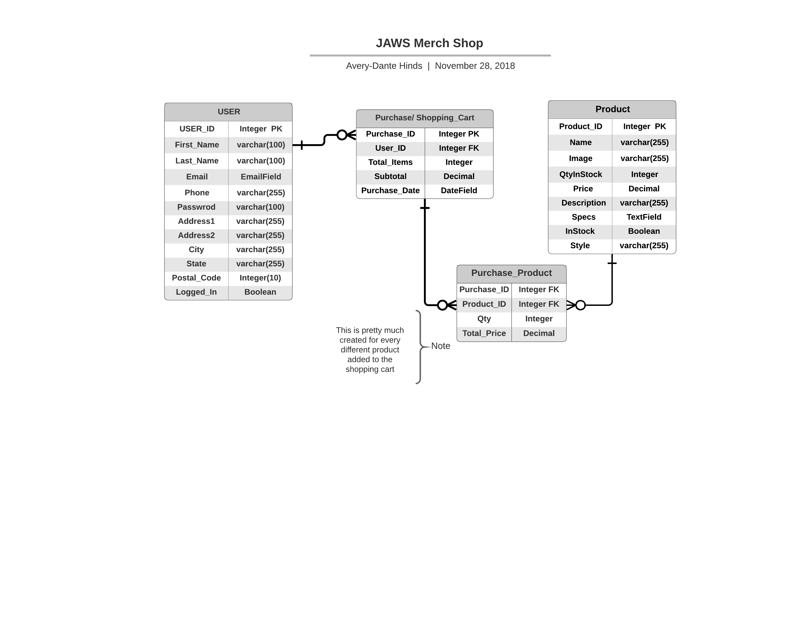

# Jack Of All Waves Website 

## About
  My Capstone project is a dynamic website for the Music Label a close friend of mine and myself started back in Philadelphia. This webpage will house information about our collective including, but not limited to: General Information about who we are, what we do, and why we do it, Music and Videos we have published, upcoming events we are hosting, and an E-commerce store where we will sell merchandise. 

## User Story 
  1. User will land on landing page. Once they click the page it    will render the        Home page
  2. User will be prompted with a modal to enter their E-mail       address for a          Newsletter. They can enter their E-mail which    will be stored in a database or      they can close the modal 
  3. There will be five tabs: About, Music, Videos, Events, and     Store
  4. User can read about the collective on the "About" page; about page will also have     contact information
  5. User can click through to fanlink and social media pages on    the "Music" page       for each artist
  6. User can view embedded Youtube videos on the "Videos" page
  7. User can view upcoming shows and tour dates on the "Events"    page
  8. User can purchase merchandise on the "Store" page
    1. User can login, store credit card, address and phone         number 
    2. User can put merchandise into their shopping cart and use  credit card o rpaypal to purchase info
    3. __Optional__ : User can log into store with google or        other authorized third party services.

## Technology
  + React JS
  + Gatsby JS
  + Firebase or Django & PostgreSQL
  + Styled Components
  + Semantic-UI/CSS
  + react-youtube

## Struggles 
  + Data Relationship
  + Store 
  + 
## Flowchart 

## Entity Relationship Diagram 

